# Comparing our novel In-lysate cDNA approach with standard bulk RNA-seq approaches

### Shreya Ghimire

### Pezzulo lab, Department of Internal Medicine, UIowa

### Jan 20, 2025 (deposited in github), originally written on May 2021 ================

# Introduction

This project contains bulk RNA-sequencing pipeline and differential gene expression analysis codes used for analyzing dataset for [Ghimire et al.Scientific Reports 2021](https://pubmed.ncbi.nlm.nih.gov/34593905/)

The dataset contains bulk RNA sequencing data of dermal fibroblasts from 6 human donors treated with either DMSO (vehicle), calmidazolium or fludrocortisone and sequenced using three approaches:

1.  In-lysate: cDNA library prepared using cell lysate and Smart-3SEQ

2.  Purified RNA: cDNA library prepared using purified RNA and Smart-3SEQ

3.  Truseq: standard bulk RNA seq approach, cDNA library prepared using purified RNA and TruSeq

Our goal is to compare our novel In-lysate approach with purified RNA and standard TruSeq approach.

## Download raw data

Raw data was downloaded from the UIowa DNA core sequencing facility for this analysis. You can find raw sequencing fastq files, processed gene counts files, and metadata in NCBI GEO using accession number: GSE164650. The GEO page corresponding to this accession number is <https://www.ncbi.nlm.nih.gov/geo/query/acc.cgi?acc=GSE164650>

I processed the raw fastq files separately for three different approaches used. After quantifying gene counts using bash shell scripts in HPC, I extracted all three gene counts files and performed differential gene expression analysis and downstream analysis together in one R project.

I downloaded the raw sequencing data and organized fastq files into appropriate directory structure using the pipeline below.

*NOTE*: The command line scripts are shown only for inlysate approach. The other 2 methods were processed in the similar way except for preprocess_fastq.sh script, which was done only for samples prepared using Smart-3SEQ (inlysate and purified RNA samples).

``` bash
wget --wait=1 -r -l3 -nd --no-parent -P /Shared/pezzulolab/inlysate/raw -A .fastq.gz http://dnacore454.healthcare.uiowa.edu/20200131-0045_Pezzulo_2013PdATFKKcNiBUcEIcvOyEWEYzNNSMForDlNbxhxPT/results/
```

I organized fastq files into appropriate directory structure: one sample per directory. For context: for a fastq file named as 01_SF2_DMSO_lane2_20200131000_S25_L002_R1_001.fastq The script below will create folder 01_SF2_DMSO and put the above .fastq file in it.

``` bash

projdir=/Shared/pezzulolab/inlysate
cd $projdir/raw

sampnames=(`ls *fastq.gz | awk '{split($1,b,"_lane"); print b[1]}' | awk '{split($1,b,"_L0"); print b[1]}' | uniq`)

n=${#sampnames[*]}
for i in $(seq 0 $((n-1)));
  do
    mkdir ${sampnames[i]}
    mv ${sampnames[i]}_*.fastq.gz ${sampnames[i]}
  done
```

## Preprocess raw fastq files

Then I processed the fastq files from inlysate and purified_RNA methods using preprocess_fastq.sh file. This script submits the raw fastq files to be pre-processed using preprocess_fastq.job and umi_homopolymer.py.

*NOTE*: In command line, run ./preprocess_fastq.sh to preprocess the raw fastq files. This script preprocess raw fastq files and create a new fastq file for each sample.

``` bash

projectdir=/Shared/pezzulolab/inlysate
outputdir=$projectdir/raw
filesuffix=R1
infilenames=(`ls $projectdir/raw/*/* | grep "$filesuffix" | grep -v "trim" | awk '{gsub(".fastq.gz","");print $0}'`)

l_infilenames=${#infilenames[*]}

for i in $(seq 0 $((l_infilenames-1)))
  do
    qsub -q all.q -pe smp 4 -e $outputdir -o $outputdir -wd $outputdir $projectdir/bin/preprocess_fastq.job $projectdir ${infilenames[i]}
  done
```

The preprocess_fastq.job process the raw fastq files and creates a trimmed file

For example: for a fastq file named 01_SF2_DMSO_lane2_20200131000_S25_L002_R1_001.fastq in a directory named 01_SF2_DMSO, a processed file named 01_SF2_DMSO_lane1_20200131000_S1_L001_R1_001_trim.fastq.gz will be created.

``` bash

projdir=$1
fileprefix=$2

gunzip $fileprefix".fastq.gz"

$projdir/bin/umi_homopolymer.py $fileprefix".fastq" $fileprefix"_trim.fastq"

gzip $fileprefix".fastq"
gzip $fileprefix"_trim.fastq"
```

The umi_homopolymer.py script called by preprocess_fastq.job file from Readfq by Heng Li, <https://github.com/lh3/readfq>

## Quality control

I used FastQC package to check the sequencing quality of all samples.FastQC can be downloaded using the following commands:

``` bash

projdir = /Shared/pezzulolab/inlysate

wget -P $projdir/bin http://www.bioinformatics.babraham.ac.uk/projects/fastqc/fastqc_v0.11.9.zip
gunzip $projdir/bin/fastqc_v0.11.9.zip
```

run_fastqc.sh script will run the FastQC software on all of the raw sequencing data sets (in gz compressed fastq format)

``` bash

projectdir=/Shared/pezzulolab/inlysate
outputdir=$projectdir/exp/20200214_FastQC_results
filesuffix=L00
filenames=(`ls $projectdir/raw/*/* | grep "$filesuffix"`)

l_filenames=${#filenames[*]}

if [ ! -d $outputdir ]; then
  mkdir $outputdir
fi

for i in $(seq 0 $((l_filenames-1)))
  do
    qsub -q all.q -N fqc_job_$i -wd $outputdir -e $outputdir -o $outputdir -pe smp 4 $projectdir/bin/run_fastqc.job $outputdir ${filenames[i]}
  done
```

Below is the script called by run_fastqc.sh.

``` bash

outputdir=$1
filename=$2

/Shared/pezzulolab/PRP_FIBS03_S3S_V2/bin/FastQC/fastqc -o $outputdir $filename
```

All FastQC files can be merged using the commands below or running ./multiqc in command line.

``` bash

fastqc_dir=/Shared/pezzulolab/inlysate/exp/20200214_FastQC_results
outdir=/Shared/pezzulolab/inlysate/exp/20200217_MultiQC_results
multiqc -o $outdir $fastqc_dir
```

The above script creates a multiqc_report.html file and a multiqc_data file with various sequencing information.

## Building genome index

I used hisat2 for mapping reads. hisat2 can be downloaded and installed using the commands below:

``` bash
projdir=/Shared/pezzulolab/inlysate

# Download .tar.gz file
wget -O $projdir/bin/hisat2-2.1.0-Linux_x86_64.zip "http://ccb.jhu.edu/software/hisat2/dl/hisat2-2.1.0-Linux_x86_64.zip"
unzip -d $projdir/bin/ $projdir/bin/hisat2-2.1.0-Linux_x86_64.zip

# Add installed HISAT2 binaries to path in bash profile 
echo -e "\nPATH=\$PATH:$projdir/bin/hisat2-2.1.0/\n" >> ~/.bash_profile
echo -e "\nexport PATH\n" >> ~/.bash_profile

# Add installed HISAT2 binaries to path for current session
PATH=$PATH:$projdir/bin/hisat2-2.1.0/
export PATH
```

### Download reference genome

To generate genome index, download the human reference genome sequence and annotation file

``` bash
refdir=/Shared/pezzulolab/inlysate/raw/ref

# Download FASTA
wget -P $refdir ftp://ftp.ncbi.nlm.nih.gov/genomes/refseq/vertebrate_mammalian/Homo_sapiens/latest_assembly_versions/GCF_000001405.39_GRCh38
.p13/GCF_000001405.39_GRCh38.p13_genomic.fna.gz

gunzip  $refdir/GCF_000001405.39_GRCh38.p13_genomic.fna.gz

# Download gene GFF
wget -P $refdir ftp://ftp.ncbi.nlm.nih.gov/genomes/refseq/vertebrate_mammalian/Homo_sapiens/latest_assembly_versions/GCF_000001405.39_GRCh38.p13/GCF_000001405.39_GRCh38.p13_genomic.gff.gz

gunzip  $refdir/GCF_000001405.39_GRCh38.p13_genomic.gff.gz

# Edit RefSeq GFF
grep '#' $refdir/GCF_000001405.39_GRCh38.p13_genomic.gff > $refdir/GCF_000001405.39_GRCh38.p13_genomic_edit.gff
grep 'transcript_id' $refdir/GCF_000001405.39_GRCh38.p13_genomic.gff >> $refdir/GCF_000001405.39_GRCh38.p13_genomic_edit.gff
awk '{gsub(/=/," \""); gsub(/;/,"\"; "); gsub(/gene/,"gene_id"); gsub(/Name/,"transcript_id"); print $0"\""}' $refdir/GCF_000001405.39_GRCh38.p13_genomic_edit.gff | less > $refdir/temp.gff
cat $refdir/temp.gff > $refdir/GCF_000001405.39_GRCh38.p13_genomic_edit.gff
rm $refdir/temp.gff

# Make FASTA file
cat $refdir/GCF_000001405.39_GRCh38.p13_genomic.fna > $refdir/HSapiens_GRCh38.p13_RefSeq.fa

# Make gene annotation file
cat $refdir/GCF_000001405.39_GRCh38.p13_genomic_edit.gff > $refdir/HSapiens_GRCh38.p13_RefSeq.gff
```

Once the files are downloaded and unzipped, I ran the build_hisat2_index.sh script in the command line. This script submits a job to the HPC job scheduler to build HISAT2 index. projdir is the project directory, fafile is the genome fasta file

``` bash

projdir=/Shared/pezzulolab/inlysate
fafile=HSapiens_GRCh38.p13_RefSeq.fa
ht2index=HSapiens_GRCh38.p13_RefSeq_hisat2ind

qsub -q CCOM -N build_index -wd $projdir/raw/ref -e $projdir/raw/ref -o $projdir/raw/ref -pe smp 16 $projdir/bin/build_hisat2_index.job $fafile $ht2index
```

Below is the build_hisat2index.job that is called by the build_hisat2_index.sh script.

``` bash
hisat2-build $1 $2
```

## Mapping reads

This script (run_hisat2.sh) submits a job to the HPC job scheduler to build HISAT2 index.

``` bash

projdir=/Shared/pezzulolab/inlysate
outputdir=20200217_HISAT2_run
ht2index=/Shared/pezzulolab/inlysate/raw/ref/HSapiens_GRCh38.p13_RefSeq_hisat2ind

if [ ! -d $projdir/exp/$outputdir ]; then
  mkdir $projdir/exp/$outputdir
fi

sample_dir=(`ls -d $projdir/raw/*/`)
l_sample_dir=${#sample_dir[*]}

for i in $(seq 0 $((l_sample_dir-1)))
  do 
    fastq_TF=$((`ls ${sample_dir[i]} | grep 'fastq' | wc -l`))
    if [ ! $fastq_TF = 0 ]; then
      sample_name_i=(`echo "${sample_dir[i]}" | awk '{split($1,temp,"raw/"); print temp[2]}' | awk '{split($1,temp2,"/"); print temp2[1]}'`)
      if [ ! -d $projdir/exp/$outputdir/HISAT2_$sample_name_i ]; then
        qsub -q CCOM -N HS2_$sample_name_i -wd $projdir/exp/$outputdir -e $projdir/exp/$outputdir -o $projdir/exp/$outputdir -pe smp 16 $projdir/bin/run_hisat2.job $projdir $ht2index $sample_name_i
      fi
    fi
  done
```

run_hisat2.sh calls the run_hisat2.job to map the reads

``` bash
projdir=$1
ht2index=$2
sampname=$3

hisat2 -x $ht2index -U $projdir/raw/$sampname/*trim* -S $sampname.sam

mkdir $sampname
mv $sampname.sam $sampname/$sampname.sam
```

Once the reads are mapped to samples, .sam files will be created for each sample. These sam files can be converted to bam files using sam2sortbam.sh script. This script submits one job for every HISAT2 sam file to the cluster to convert sam to bam and sort.

``` bash

projdir=/Shared/pezzulolab/inlysate
HS2dir=/Shared/pezzulolab/inlysate/exp/20200217_HISAT2_run

cd $HS2dir

filedir=(`ls -d */ | awk '{split($1,b,"/"); print b[1]}'`)
l_filedir=${#filedir[*]}

for i in $(seq 0 $((l_filedir-1)))
  do
    if [ ! -f $HS2dir/${filedir[i]}/${filedir[i]}"_sorted.bam" ]; then
      qsub -N sam2sortbam_${filedir[i]} -q all.q -pe smp 4 -wd $HS2dir/${filedir[i]} -e $HS2dir/${filedir[i]} -o $HS2dir/${filedir[i]} $projdir/bin/sam2sortbam.job $HS2dir ${filedir[i]}
    fi
  done
```

Below is sam2sortbam.job file. This script moves a sam file to localscratch and converts into a single sorted bam file.

``` bash
module load samtools

HS2dir=$1
filename=$2
usrname=(`whoami`)

# Clear local scratch of files with same filename
rm -r /localscratch/Users/$usrname/*$filename*

# Copy sam file to localscratch
cp $HS2dir/$filename/*sam /localscratch/Users/$usrname

# Change directory to localscratch and merge sam files
cd /localscratch/Users/$usrname

# Convert sam to bam and sort and index
samtools view -bS $filename".sam" > $filename".bam"
samtools sort -o $filename"_sorted.bam" $filename".bam"
samtools index $filename"_sorted.bam"

# Move sorted bam and index from localscratch back to directory
mv /localscratch/Users/$usrname/$filename"_sorted.bam" $HS2dir/$filename
mv /localscratch/Users/$usrname/$filename"_sorted.bam.bai" $HS2dir/$filename
```

Merging all the bam files into one using merge_bam.sh script. This script submits a job that merges bam files and indexes the merged file

``` bash

projdir=/Shared/pezzulolab/inlysate
samdir=/Shared/pezzulolab/inlysate/exp/20200217_HISAT2_run
outdir=/Shared/pezzulolab/inlysate/exp/20200217_HISAT2_run
qsub -q CCOM -N mrg_bam -pe smp 56 -wd $outdir -e $outdir -o $outdir $projdir/bin/merge_bam.job $samdir $outdir
```

The script below merges all bam files and indexes the merged file

``` bash

module load samtools
samdir=$1
outdir=$2

samtools merge $outdir/merged.bam $samdir/*/*_sorted.bam
samtools index $outdir/merged.bam
```

## Extracting read counts per sample

To count the mapped reads, I used featurecounts from subread package.Subread can be downloaded using the following codes in the command line:

``` bash

projdir=/Shared/pezzulolab/inlysate

# Download .tar.gz file
wget -O $projdir/bin/subread-1.6.4-Linux-x86_64.tar.gz "https://sourceforge.net/projects/subread/files/subread-1.6.4/subread-1.6.4-Linux-x86_64.tar.gz/download"

# Unpack .tar.gz file
tar -C $projdir/bin -xzvf $projdir/bin/subread-1.6.4-Linux-x86_64.tar.gz

# Add installed binaries to path in bash profile 
echo -e "\nPATH=\$PATH:$projdir/bin/subread-1.6.4-Linux-x86_64/bin/\n" >> ~/.bash_profile
echo -e "\nexport PATH\n" >> ~/.bash_profile

# Add installed binaries to path for current session
PATH=$PATH:$projdir/bin/subread-1.6.4-Linux-x86_64/bin/
export PATH
```

Now, run run_featurescounts.sh file. This script submits all jobs to the HPC job scheduler.

``` bash

projdir=/Shared/pezzulolab/inlysate
inputdir=$projdir/exp/20200217_HISAT2_run
#outputdir=$projdir/exp/20200219_featurecounts_run
outputdir=$projdir/exp/20210411_featurecounts_run
usrname=(`whoami`)

if [ ! -d $outputdir ]; then
  mkdir $outputdir
fi

sampledir=(`ls -d $inputdir/*/`)
l_sample_dir=${#sampledir[*]}

for i in $(seq 0 $((l_sample_dir-1)))
  do 
    fastq_TF=$((`ls ${sampledir[i]} | grep '.sam' | wc -l`))
    if [ ! $fastq_TF = 0 ]; then
      sample_name_i=(`ls ${sampledir[i]} | grep ".sam" | awk '{split($1,temp,".sam"); print temp[1]}'`)
      if [ ! -d $outputdir/featurecounts_$sample_name_i ]; then
        qsub -q CCOM,UI -N fc_job_$sample_name_i -wd /localscratch/Users/$usrname -e /localscratch/Users/$usrname -o /localscratch/Users/$usrname -pe smp 16 $projdir/bin/run_featurecounts.job $projdir $inputdir $outputdir $sample_name_i 
      fi
    fi
  done
```

Below is the run_featurecounts.job file. This script is called by run_featurecounts.sh.The refname argument below will need to be changed for other reference transcriptome builds.

``` bash

projdir=$1
inputdir=$2
outputdir=$3
sampname=$4
usrname=(`whoami`)

refname=HSapiens_GRCh38.p13_RefSeq.gff

# change directory to localscratch
cd /localscratch/Users/$usrname

# make directory to hold .sam file
mkdir /localscratch/Users/$usrname/$sampname/

#copy .sam file and transcriptome into localscratch
cp $inputdir/$sampname/*.sam /localscratch/Users/$usrname/$sampname/

#If local_scratch, copy each instance. If nfs_scratch, copy once and erase at end
cp -r $projdir/raw/ref/$refname /localscratch/Users/$usrname/$sampname/

#execute process
mkdir /localscratch/Users/$usrname/$sampname/featurecounts_$sampname

cd /localscratch/Users/$usrname/$sampname/featurecounts_$sampname

sam_filename=(`ls /localscratch/Users/$usrname/$sampname | grep "sam"`)

featureCounts -a /localscratch/Users/$usrname/$sampname/$refname -F GTF -t exon -g gene_id -s 1 --read2pos 5 -o /localscratch/Users/$usrname/$sampname/featurecounts_$sampname/featurecounts_$sampname.txt /localscratch/Users/$usrname/$sampname/$sam_filename

if [ ! -d $outputdir ]; then 
  mkdir $outputdir; 
fi

#move results, STDERR, and STDOUT to home results
mv /localscratch/Users/$usrname/$sampname/featurecounts_$sampname $outputdir/featurecounts_$sampname

#disk usage max
echo "scratch disk usage max"
du -sh /localscratch/Users/$usrname/

#remove fastq files and transcriptome from localscratch
rm -r /localscratch/Users/$usrname/$sampname

#disk usage postmove results
echo "scratch disk usage postmove"
du -sh /localscratch/Users/$usrname/

mv $SGE_STDOUT_PATH $outputdir/
mv $SGE_STDERR_PATH $outputdir/
```

The script below (process_featurecounts.sh) will process the results for runs of featureCounts using process_featurecounts.R script. Run this script in command line.

``` bash

module load R

projectdir=/Shared/pezzulolab/inlysate
outputdir=$projectdir/exp/20210411_featurecounts_run
fnames=(`ls $outputdir/*/*summary`)
samp_names=(`ls $outputdir/ | awk '{split($1,b,"featurecounts_"); print b[2]}'`)

echo "Sample" > $outputdir/var_names
awk 'NR > 1 && NR < 14{print $1}' ${fnames[0]} >> $outputdir/var_names
cat $outputdir/var_names > $outputdir/all_run_info.txt

n=${#fnames[*]}
for i in $(seq 0 $((n-1)));
  do
    echo ${samp_names[i]} > $outputdir/temp1;
    awk 'NR > 1 && NR < 14{print $2}' ${fnames[i]} >> $outputdir/temp1;
    cat $outputdir/all_run_info.txt > $outputdir/temp2;
    paste $outputdir/temp2 $outputdir/temp1 > $outputdir/all_run_info.txt;
  done
  
rm $outputdir/temp1 $outputdir/temp2 $outputdir/var_names

Rscript --no-save --no-restore $projectdir/bin/process_featurecounts.R > $outputdir/temp.Rout $outputdir

rm $outputdir/temp.Rout
```

Below is the Rscript called by above process_featurecounts.sh file.This script will accept a directory prefix as an argument and (1) plot pseudoalignment quality measurements (2) merge the featurecounts abundance results for all samples

``` r
CLargs<-commandArgs(TRUE)

dir_name<-CLargs[1]

# Plotting featureCounts quality results
temp<-read.csv(paste(dir_name,'/all_run_info.txt',sep=''),sep='\t',row.names=1)
featurecounts_quality_dat<-as.data.frame(t(temp))

pdf(paste(dir_name,'/featurecounts_results.pdf',sep=''))
barplot(featurecounts_quality_dat$Assigned,names.arg=dimnames(featurecounts_quality_dat)[[1]],main='# of aligned reads annotated',cex.names=0.75,las=2)

barplot(featurecounts_quality_dat$Assigned/rowSums(featurecounts_quality_dat),names.arg=dimnames(featurecounts_quality_dat)[[1]],main='% of aligned reads annotated',cex.names=0.75,las=2,ylim=c(0,1))
dev.off()

# Merging featureCounts count results

fnames<-dir(dir_name,pattern='.txt',recursive=TRUE)
fnames_discard<-c('all_run_info.txt',dir(dir_name,pattern='.summary',recursive=TRUE))
fnames<-fnames[!fnames%in%fnames_discard]
dir_fnames<-paste(dir_name,'/',fnames,sep='')
colnames4dat<-unlist(strsplit(unlist(lapply(strsplit(fnames,split='featurecounts_'),function(x){x[2]})),split='/'))

for(i in 1:length(dir_fnames)){
  dat_i<-read.table(dir_fnames[i],sep='\t',header=TRUE)
  if(i==1){
    length_dat<-data.frame(dat_i[,1], dat_i[,6])
    counts_dat<-data.frame(dat_i[,1], dat_i[,7])
    names(length_dat)<-c('gene',colnames4dat[i])
    names(counts_dat)<-c('gene',colnames4dat[i])
  }
  if(i>1){
    temp_length<-data.frame(dat_i[,1], dat_i[,6])
    temp_counts<-data.frame(dat_i[,1], dat_i[,7])
    names(temp_length)<-c('gene',colnames4dat[i])
    names(temp_counts)<-c('gene',colnames4dat[i])

    length_dat<-merge(length_dat,temp_length,by="gene",all=TRUE)
    counts_dat<-merge(counts_dat,temp_counts,by="gene",all=TRUE)
  }
}

write.table(length_dat,file=paste(dir_name,'/gene_length.tsv',sep=''),row.names=FALSE,quote=FALSE,sep='\t')
write.table(counts_dat,file=paste(dir_name,'/gene_count.tsv',sep=''),row.names=FALSE,quote=FALSE,sep='\t')
```

Once all the samples are processed, a gene_count.tsv and gene_length.tsv will be created in the projectdir/exp/featurecounts_run folder.

## Load, format & merge data

Gene counts for each method is in the gene_counts folder. It can be downloaded through GEO accession number GSE164650 or this website <https://www.ncbi.nlm.nih.gov/geo/query/acc.cgi?acc=GSE164650>

Loading gene counts and sample metadata files

``` r
samp_metadata<- read.csv("./samp_metadata.csv", row.names = 1)
inlysate_counts<-read.csv("./gene_counts/inlysate_raw_gene_counts_merged.txt", sep = "\t", row.names = 1, header = TRUE) 
purifiedRNA_counts<-read.csv("./gene_counts/purified_RNA_raw_gene_counts_merged.txt", sep = "\t", row.names = 1, header = TRUE)
truseq_counts<-read.csv("./gene_counts/truseq_raw_gene_counts_merged.txt", sep = "\t", row.names = 1, header = TRUE)
inlysate_counts$gene_name<- rownames(inlysate_counts)
purifiedRNA_counts$gene_name<-rownames(purifiedRNA_counts)
truseq_counts$gene_name<-rownames(truseq_counts)
```

Merging all counts file

``` r
raw_counts_merged=
  as.data.frame(
    bind_rows(tibble(melt(inlysate_counts, variable.name = "sample_name", value.name = "gene_counts", id.vars = "gene_name")) %>%
              add_column("method"="inlysate","library_prep"="Smart3seq",.after =3),
            tibble(melt(purifiedRNA_counts,variable.name = "sample_name", value.name = "gene_counts", id.vars = "gene_name"))%>%
             add_column("method"="purifiedRNA","library_prep"="Smart3seq",.after =3),
            tibble(melt(truseq_counts, variable.name = "sample_name",value.name = "gene_counts", id.vars = "gene_name"))%>%
              add_column("method"="truseq","library_prep"="truseq",.after=3))) %>%
  add_column("treatment"=unlist(lapply(strsplit(as.character(raw_counts_merged$sample_name), split = "_"), function(x){x[3]})),
             "sample_num"=unlist(lapply(strsplit(as.character(raw_counts_merged$sample_name), split = "_"), function(x){x[2]})))

raw_counts_merged$full_sample_name<-paste(raw_counts_merged$sample_name, raw_counts_merged$method, sep = "_")
gene_length<-read.csv("./for github/gene_counts/gene_length.txt",sep=" ", row.names = 1)
raw_counts_merged$gene_length<-gene_length$gene_length[match(raw_counts_merged$gene_name, rownames(gene_length))]
write.csv(raw_counts_merged, "./raw_counts_merged.csv") 
head(raw_counts_merged)             
```

Total counts per sample getting counts per million.

``` r
gene_length<-read.csv("./for github/gene_counts/gene_length.txt",sep=" ", row.names = 1)
raw_counts_merged$gene_length<-gene_length$gene_length[match(raw_counts_merged$gene_name, rownames(gene_length))]
inlysate_cpm<-as.data.frame(t(log2(t(inlysate_counts)/colSums(inlysate_counts)*1e6+1)))
purifiedRNA_cpm<-as.data.frame(t(log2(t(purifiedRNA_counts)/colSums(purifiedRNA_counts)*1e6+1)))
#normalize by gene length for truseq
truseq_counts_norm<-as.data.frame(truseq_counts/gene_length$gene_length)
truseq_cpm<- as.data.frame(t(log2(t(truseq_counts_norm)/colSums(truseq_counts_norm)*1e6+1)))

inlysate_cpm<-melt(inlysate_cpm, variable.name = "sample_name", value.name = "gene_cpm")
purifiedRNA_cpm<-melt(purifiedRNA_cpm, variable.name = "sample_name", value.name = "gene_cpm")
truseq_cpm<-melt(truseq_cpm, variable.name = "sample_name", value.name = "gene_cpm")

raw_counts_merged$gene_counts_cpm<="NA"
raw_counts_merged$gene_counts_cpm[raw_counts_merged$method=="inlysate"]<-inlysate_cpm$gene_cpm
raw_counts_merged$gene_counts_cpm[raw_counts_merged$method=="purifiedRNA"]<-purifiedRNA_cpm$gene_cpm
raw_counts_merged$gene_counts_cpm[raw_counts_merged$method=="truseq"]<-truseq_cpm$gene_cpm

write.csv(raw_counts_merged, "./raw_counts_merged.csv") 
```

## Plotting counts by sample

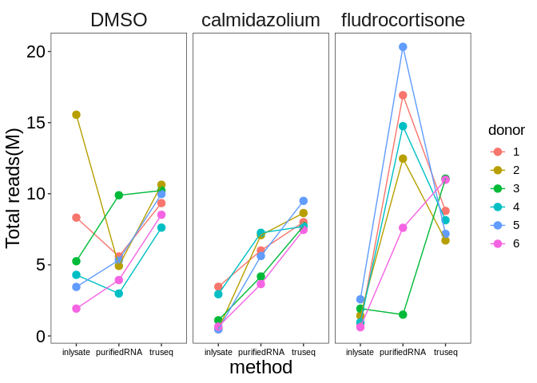<!-- -->

## Pairwise correlations within treatments

Start by creating a tidy data table such that all pairs of samples are aligned with each other. This will make it easier to calculate all pairwise correlations below, since I can group by the "Sample_Pair" column and calculate the correlation between the "gene_counts.x" and "gene_counts.y" columns.

*NOTE*: This operation is a bit memory intensive, so it's best to run the code once and save the result.

``` r
full_pairwise_quants=
  raw_counts_merged %>%
  full_join(raw_counts_merged, by=c("treatment", "gene_name", "gene_length"))%>%
  # Remove correlations between the same samples
  filter(full_sample_name.x != full_sample_name.y) %>%
  # Identify and remove duplicated, reciprocal pairs (i.e. a vs b = b vs a)
  mutate(Sample_Pair =
           case_when(full_sample_name.x < full_sample_name.y ~ glue::glue("{full_sample_name.x} - {full_sample_name.y}"),
                     TRUE ~ glue::glue("{full_sample_name.y} - {full_sample_name.x}"))) %>%
  distinct(Sample_Pair, gene_name, .keep_all = TRUE)
#saveRDS(full_pairwise_quants, "./Pairwise_correlation_matrix.rds")
```

### Calculate pairwise correlations

*NOTE*: This calculation also takes a bit of time and memory, but it's much better than the formatting operation above.

#### Generating heatmap of pairwise correlation, Figure 3

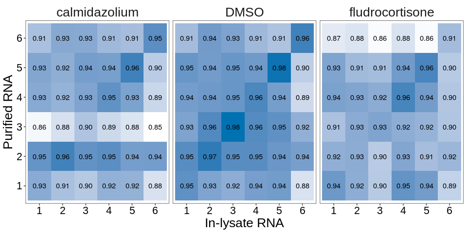<!-- -->

#### Including truseq data as well, supplement fig3

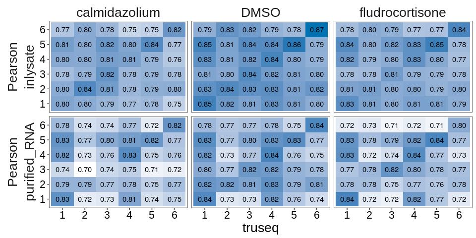<!-- -->

## Differential gene expression analysis

``` r
inlysate_tmp<-DESeqDataSetFromMatrix(countData = inlysate_counts, colData = samp_metadata, design = ~donor1 +treatment2)
inlysate_dds<-DESeq(inlysate_tmp)
inlysate_calm_res<-results(inlysate_dds, contrast = c("treatment2","calmidazolium","DMSO"))
inlysate_fludro_res<-results(inlysate_dds, contrast = c("treatment2","fludrocortisone ","DMSO"))

purifiedRNA_tmp<-DESeqDataSetFromMatrix(countData = purifiedRNA_counts, colData = samp_metadata, design = ~donor1 +treatment2)
purifiedRNA_dds<-DESeq(purifiedRNA_tmp)
purified_RNA_calm_res<-results(purifiedRNA_dds, contrast = c("treatment2","calmidazolium","DMSO"))
purified_RNA_fludro_res<-results(purifiedRNA_dds, contrast = c("treatment2","fludrocortisone ","DMSO"))

truseq_tmp<-DESeqDataSetFromMatrix(countData = truseq_counts, colData = samp_metadata, design = ~donor1 +treatment2)
truseq_dds<-DESeq(truseq_tmp)
truseq_calm_res<-results(truseq_dds, contrast = c("treatment2","calmidazolium","DMSO"))
truseq_fludro_res<-results(truseq_dds, contrast = c("treatment2","fludrocortisone ","DMSO"))

load("../deseq2_results/truseq_calm_res")
load("../deseq2_results/truseq_fludro_res")
load("../deseq2_results/inlysate_calm_res")
```

### Merge DESeq2 results

Merging results for each treatment vs vehicle group, across all 3 methods into a single table.

``` r
fdr_cutoff=0.1
merged_deseq2_results=
  bind_rows(tibble(as.data.frame(inlysate_calm_res))%>%
              add_column("method"="inlysate","Comparison"="Calmidazolium_vs_DMSO","genes"=rownames(inlysate_calm_res),.before=1),
            tibble(as.data.frame(inlysate_fludro_res)) %>%
              add_column("method"="inlysate","Comparison"="Fludrocortisone_vs_DMSO","genes"=rownames(inlysate_fludro_res),.before=1),
            tibble(as.data.frame(purified_RNA_calm_res)) %>%
              add_column("method"="purified_RNA","Comparison"="Calmidazolium_vs_DMSO","genes"=rownames(purified_RNA_calm_res),.before=1),
            tibble(as.data.frame(purified_RNA_fludro_res)) %>%
              add_column("method"="purified_RNA","Comparison"="Fludrocortisone_vs_DMSO","genes"=rownames(purified_RNA_fludro_res),.before=1),
            tibble(as.data.frame(truseq_calm_res)) %>%
              add_column("method"="truseq","Comparison"="Calmidazolium_vs_DMSO","genes"=rownames(truseq_calm_res),.before=1),
            tibble(as.data.frame(truseq_fludro_res)) %>%
              add_column("method"="truseq","Comparison"="Fludrocortisone_vs_DMSO","genes"=rownames(truseq_fludro_res),.before=1)
  ) %>%
  
  mutate(isDEG=case_when(padj <fdr_cutoff ~"DEG",
                         padj >= fdr_cutoff ~ "non-DEG", TRUE ~ "filtered")) %>%
  mutate(is_sig=case_when(padj <fdr_cutoff & abs(log2FoldChange)>1 ~"sig",
                          padj < fdr_cutoff & abs(log2FoldChange)<=1 ~"non-sig",
                          padj>=fdr_cutoff ~"non-sig",TRUE~"filtered")) 
```

save the merged deseq2 file for future

Counting number of DEGs, non-DEGs and filtered genes for each comparison using FDR cutoff of 0.1

``` r
merged_deseq2_results %>% 
  count(method, Comparison, isDEG) %>% 
  pivot_wider(names_from = isDEG, values_from = n) %>% 
  dplyr::select(method, Comparison, DEG, `non-DEG`, filtered)
```

    ## # A tibble: 6 × 5
    ##   method       Comparison                DEG `non-DEG` filtered
    ##   <chr>        <chr>                   <int>     <int>    <int>
    ## 1 inlysate     Calmidazolium_vs_DMSO    1197      8850    28476
    ## 2 inlysate     Fludrocortisone_vs_DMSO   688     11243    26592
    ## 3 purified_RNA Calmidazolium_vs_DMSO    2822      8587    27114
    ## 4 purified_RNA Fludrocortisone_vs_DMSO  1608     12356    24559
    ## 5 truseq       Calmidazolium_vs_DMSO    3210      9552    25761
    ## 6 truseq       Fludrocortisone_vs_DMSO  2119     12479    23925

### Plotting MA plot (Figure 4a)

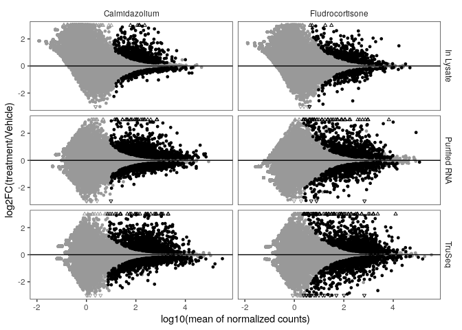<!-- -->

### Plotting Volcano plot (Figure 4b)

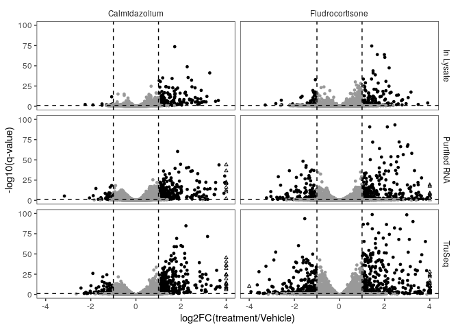<!-- -->

### Calculating log2Fold Change correlation across methods (Figure 5)

Labeling DEGs that were identified by both inlysate and purified RNA method, only by one method, or neither

``` r
degs_by_method =
  merged_deseq2_results %>% 
  filter(method != "truseq") %>% 
  dplyr::select(method, Comparison, genes, log2FoldChange, padj) %>% 
  pivot_longer(cols = c(log2FoldChange, padj), names_to = "stat",
               values_to = "value") %>% 
  unite("method.stat", method, stat, sep = ".") %>% 
  pivot_wider(names_from = method.stat, values_from = value) %>% 
  mutate(DE_status = 
           case_when(
             inlysate.padj < fdr_cutoff & purified_RNA.padj < fdr_cutoff ~
               paste0("Both\nq-value < ", fdr_cutoff),
             inlysate.padj < fdr_cutoff ~
               paste0("In lysate\nq-value < ", fdr_cutoff),
             purified_RNA.padj < fdr_cutoff ~
               paste0("Purified\nq-value < ", fdr_cutoff),
             inlysate.padj >= fdr_cutoff & purified_RNA.padj >= fdr_cutoff ~
               paste0("Both\nq-value >= ", fdr_cutoff),
             TRUE ~ NA_character_
           ),
         DE_status = factor(DE_status,
                            levels = c(paste0("Both\nq-value < ", fdr_cutoff),
                                       paste0("In lysate\nq-value < ", fdr_cutoff),
                                       paste0("Purified\nq-value < ", fdr_cutoff),
                                       paste0("Both\nq-value >= ", fdr_cutoff))),
         Column_facet = stringr::str_remove(Comparison, "_vs_DMSO"))

write.csv(as.data.frame(degs_by_method), file="./degs_by_method.csv")
```

Plotting DEGs that were identified by both inlysate and purified RNA method, only by one method, or neither (Figure 5a)

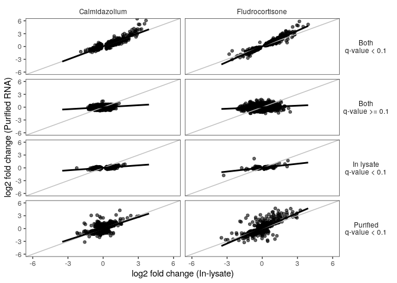<!-- -->

For DEGs identified by one method but not the other, examine the q-value distribution from the other method. This allows to determine if these DEGs are just outside the q-value cutoff of the other method Figure 5b

``` r
degs_by_method %>% 
    filter(!is.na(DE_status),
           !grepl("Both", as.character(DE_status))) %>% 
    dplyr::select(Comparison, Column_facet, genes, DE_status, ends_with("padj")) %>% 
    # Only want to plot q-values from the method that didn't identify the DEG
    mutate(display_qvalue = case_when(grepl("Purified", DE_status) ~ inlysate.padj,
                                      grepl("In lysate", DE_status) ~ purified_RNA.padj,
                                      TRUE ~ NA_real_),
           # Still want filtered genes to display in this plot, but separately from the everything else.
           display_qvalue = replace_na(display_qvalue, 1.1)) %>% 
    ggplot(aes(x = display_qvalue, fill = DE_status), color="black") +
    geom_histogram(binwidth = 0.05, color="black") +
    facet_grid(rows = vars(DE_status), cols = vars(Column_facet)) +
    theme_bw() +
    theme(legend.position = "None",
          strip.text.y = element_text(angle = 0),
          strip.background = element_blank())
```

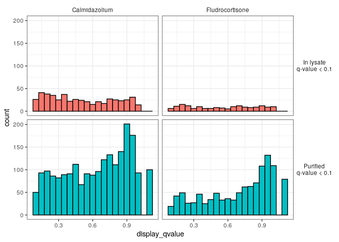<!-- -->

Count the number of genes in each groups (Figure 5c)

``` r
degs_by_method %>% 
    filter(!is.na(DE_status)) %>% 
    # Replace newline characters with spaces for display purposes
    mutate(DE_status = stringr::str_replace(as.character(DE_status),
                                            "\n", " ")) %>% 
    count(Column_facet, DE_status) %>% 
    pivot_wider(names_from = Column_facet, values_from = n)
```

    ## # A tibble: 4 × 3
    ##   DE_status               Calmidazolium Fludrocortisone
    ##   <chr>                           <int>           <int>
    ## 1 Both q-value < 0.1                704             517
    ## 2 Both q-value >= 0.1              6821           10211
    ## 3 In lysate q-value < 0.1           493             171
    ## 4 Purified q-value < 0.1           2118            1091

## Generating ROC and PR curve

Calculating Receiver Operating Curve (ROC) and Precision-Recall (PR) curve by comparing inlysate and purified RNA to Illumina TruSeq method

### Loading and formatting data

``` r
#getting genes that in calmidazolium vs DMSO comparison and are present in all 3 methods
genes_calm<-merged_deseq2_results %>%
  filter(!is.na(padj) & Comparison=="Calmidazolium_vs_DMSO") %>%
  group_by(genes) %>% 
  summarize(method_count=n_distinct(method), .groups = "drop") %>%
  filter(method_count==3) %>% pull(genes)

#getting genes that in fludrocortisone vs DMSO comparison and are present in all 3 methods
genes_fludro<-merged_deseq2_results %>%
  filter(!is.na(padj) & Comparison=="Fludrocortisone_vs_DMSO") %>%
  group_by(genes) %>% 
  summarize(method_count=n_distinct(method), .groups = "drop") %>%
  filter(method_count==3) %>% pull(genes)

#creating data frame for calm and fludro by filtering genes

calm_genes_df<-merged_deseq2_results %>%
  filter(genes %in% genes_calm & Comparison=="Calmidazolium_vs_DMSO")

fludro_genes_df<-merged_deseq2_results %>%
  filter(genes %in% genes_fludro & Comparison=="Fludrocortisone_vs_DMSO")
```

### Calculating ROC and PR

``` r
#calmidazolium
roc_inlysate_calm<-prediction(predictions = 1-(calm_genes_df$padj[calm_genes_df$method=="inlysate"]), labels = calm_genes_df$padj[calm_genes_df$method=="truseq"]<0.1)

roc_purified_calm<-prediction(predictions = 1-(calm_genes_df$padj[calm_genes_df$method=="purified_RNA"]), labels = calm_genes_df$padj[calm_genes_df$method=="truseq"]<0.1)

#fludrocortisone
roc_inlysate_fludro<-prediction(predictions = 1-(fludro_genes_df$padj[fludro_genes_df$method=="inlysate"]), labels = fludro_genes_df$padj[fludro_genes_df$method=="truseq"]<0.1)

roc_purified_fludro<-prediction(predictions = 1-(fludro_genes_df$padj[fludro_genes_df$method=="purified_RNA"]), labels = fludro_genes_df$padj[fludro_genes_df$method=="truseq"]<0.1)
```

### Plotting ROC and PR curves (Figure 6)

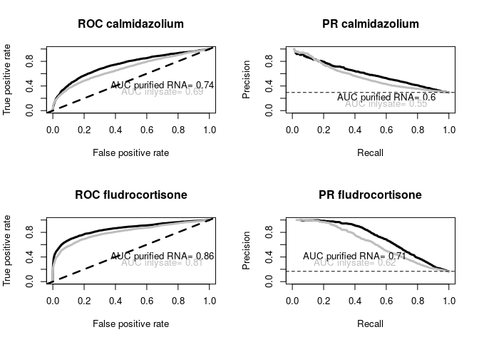<!-- -->

## Generating concordance plot

Formatting the data for calculating concordance

*NOTE:* This process is memory intensive.

``` r
#Function to process data

process_data<-function(data){
  data<-as.data.frame(data[c(2,6)])
  data$abs_log2FC<-abs(data$log2FoldChange)
  data[order(data$padj, data$abs_log2FC),]
}

#Applying function to datasets
inlysate_calm<-process_data(inlysate_calm_res)
purified_calm<-process_data(purified_RNA_calm_res)
truseq_calm<-process_data(purified_RNA_calm_res)

#Merge data and add rank
merged_calm<-data.frame(
  truseq=rownames(truseq_calm),
  inlysate=rownames(inlysate_calm),
  purified_RNA=rownames(purified_calm)
)

merged_calm$rank<-seq_len(nrow(merged_calm))

#creating randomized list of genes using trusew genes
merged_calm$rand_truseq <- sample(rownames(truseq_calm))

# Helper function for cumulative duplicated count
get_cumulative_duplicates <- function(list1, list2) {
  sapply(seq_along(list1), function(i) sum(duplicated(c(list1[1:i], list2[1:i]))))
}

# Compute duplicate counters
merged_calm$inlysate_truseq <- get_cumulative_duplicates(merged_calm$truseq, merged_calm$inlysate)
merged_calm$purified_truseq <- get_cumulative_duplicates(merged_calm$truseq, merged_calm$purified_RNA)
merged_calm$inlysate_purified <- get_cumulative_duplicates(merged_calm$inlysate, merged_calm$purified_RNA)
merged_calm$rand_truseq_truseq <- get_cumulative_duplicates(merged_calm$truseq, merged_calm$rand_truseq)

write.csv(merged_calm,"./merged_calm.csv")
```

``` r
merged_calm_trans <- merged_calm %>%
  dplyr::select(rank, inlysate_truseq, purified_truseq, inlysate_purified, rand_truseq_truseq) %>%
  mutate(
    inlysate_truseq_trans = inlysate_truseq / rank,
    purified_truseq_trans = purified_truseq / rank,
    inlysate_purified_trans = inlysate_purified / rank,
    rand_truseq_truseq_trans = rand_truseq_truseq / rank
  )

# Reshape for plotting
#reshape  and plot
merged_calm_trans<-merged_calm_trans %>%
  dplyr::select(rank, ends_with("trans"))
merged_calm_trans<-reshape(merged_calm_trans,direction = "long",idvar = "rank",varying = c(2,3,4,5),v.names = "trans_value",
            times = c("inlysate_truseq","purified_truseq","inlysate_purified","rand_truseq_truseq"))  
colnames(merged_calm_trans)<-c("rank","Comparison","value")

# Final dataset
print(head(merged_calm_trans))
write.csv(merged_calm_trans, "./merged_calm_trans.csv")
```

Repeat the same process for fludrocortisone. Loading fludrocortisone data

### Plotting concordance for first 3000 genes (Figure 7)

``` r
merged_calm_trans<-read.csv("./merged_calm_trans.csv")
merged_fludro_trans<-read.csv("./merged_fludro_trans.csv")

my_pal<-c("#D55E00","#0072B2","#CC79A7","#999999")

merged_calm_trans_sub<-merged_calm_trans[merged_calm_trans$rank %in% c(1:3000),] 
names(my_pal)<-unique(merged_calm_trans_sub$Comparison)


par(mfrow=c(2,2))
p1<-ggplot(merged_calm_trans_sub,aes(x=rank,y=value))+
  geom_line(aes(color=Comparison),size=1)+scale_color_manual(values = my_pal)+
  ggtitle("calm_first 30000 genes")+
  theme_bw() +
  theme(strip.background = element_blank(), panel.grid = element_blank())
```

    ## Warning: Using `size` aesthetic for lines was deprecated in ggplot2 3.4.0.
    ## ℹ Please use `linewidth` instead.
    ## This warning is displayed once every 8 hours.
    ## Call `lifecycle::last_lifecycle_warnings()` to see where this warning was
    ## generated.

``` r
merged_fludro_trans_sub<-merged_fludro_trans[merged_fludro_trans$rank %in% c(1:3000),] 
names(my_pal)<-unique(merged_fludro_trans_sub$Comparison)

p2<-ggplot(merged_fludro_trans_sub,aes(x=rank,y=value))+
  geom_line(aes(color=Comparison),size=1)+scale_color_manual(values = my_pal)+
  ggtitle("Fludro_first 30000 genes")+
  theme_bw() +
  theme(strip.background = element_blank(), panel.grid = element_blank())

plot_grid(p1,p2)
```

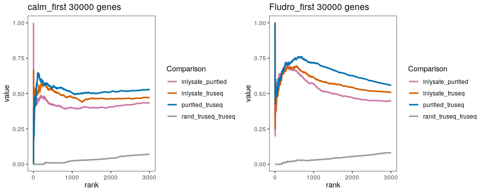<!-- -->

## Pathway analysis

using : <https://stephenturner.github.io/deseq-to-fgsea/> to get hallmark gene set from MSigDB v7.4

use stat column from deseq2 result as input rank in fgsea

### Load hallmark gene set

``` r
#loading hallmmark gene set
pathways.hallmark <- gmtPathways("./h.all.v7.4.symbols.gmt")
```

### Running fgsea

Running fgsea for calmidazolium VS DMSO treatment

1.  TruSeq data

``` r
#getting ranked list

truseq_calm_rank_df<-truseq_calm_res %>% add_column("genes"=rownames(truseq_calm_res),.before = 1) %>%
  dplyr::select(genes,stat)%>% na.omit()%>% distinct()%>% group_by(genes) %>%summarise(stat=mean(stat))
truseq_calm_rank<-deframe(truseq_calm_rank_df)

#Now, run the fgsea algorithm with 1000 permutations:
fgseaRes_truseq_calm <- fgsea(pathways=pathways.hallmark, stats=truseq_calm_rank, nperm=1000)
fgseaRes_truseq_calm_tidy<-fgseaRes_truseq_calm %>% as_tibble()%>% arrange(desc(NES))
fgseaRes_truseq_calm_tidy %>% 
  dplyr::select(-leadingEdge, -ES, -nMoreExtreme) %>% 
  arrange(padj) 

#Plot the normalized enrichment scores. Color the bar indicating whether or not the pathway was significant:
ggplot(fgseaRes_truseq_calm_tidy, aes(reorder(pathway, NES), NES)) +
  geom_col(aes(fill=padj<0.05)) +
  coord_flip() +
  labs(x="Pathway", y="Normalized Enrichment Score",
       title="Hallmark pathways NES from GSEA-truseq_calm") + 
  theme_minimal()
```

2.  In lysate method

3.  Purified RNA method

### Merging and formating fgsea output

Preparing data by merging and formatting fgsea results from all 3 methods into one table

``` r
fgsea_merged_calm<-data.frame(pathways=fgseaRes_truseq_calm_tidy$pathway,NES_truseq=fgseaRes_truseq_calm_tidy$NES)
inlysate_NES<-fgseaRes_inlysate_calm_tidy$NES[match(fgsea_merged_calm$pathways,fgseaRes_inlysate_calm_tidy$pathway)]
purified_NES<-fgseaRes_purified_calm_tidy$NES[match(fgsea_merged_calm$pathways,fgseaRes_purified_calm_tidy$pathway)]
fgsea_merged_calm$NES_inlysate<-inlysate_NES
fgsea_merged_calm$NES_purified<-purified_NES

#adding padj 
inlysate_padj<-fgseaRes_inlysate_calm_tidy$padj[match(fgsea_merged_calm$pathways,fgseaRes_inlysate_calm_tidy$pathway)]
purified_padj<-fgseaRes_purified_calm_tidy$padj[match(fgsea_merged_calm$pathways,fgseaRes_purified_calm_tidy$pathway)]
truseq_padj<-fgseaRes_truseq_calm_tidy$padj[match(fgsea_merged_calm$pathways,fgseaRes_truseq_calm_tidy$pathway)]
fgsea_merged_calm$padj_inlysate<-inlysate_padj
fgsea_merged_calm$padj_purified<-purified_padj
fgsea_merged_calm$padj_truseq<-truseq_padj


#For plotting positive, negative or no enrichment in a heatmap. Add columns to reflect following"
#positive enrichment: NES>1 and qvalue < 0.05
#no enrichemnnt: qvvalue >=0.05
#negative enrichment: NES<1 and qvalue<0.05

fgsea_merged_calm$truseq<-ifelse(fgsea_merged_calm$padj_truseq > 0.05 , 0,
                                 ifelse(fgsea_merged_calm$NES_truseq>0,1,-1 ))
fgsea_merged_calm$inlysate<-ifelse(fgsea_merged_calm$padj_inlysate > 0.05 , 0,
                                 ifelse(fgsea_merged_calm$NES_inlysate>0,1,-1 ))
fgsea_merged_calm$purified<-ifelse(fgsea_merged_calm$padj_purified > 0.05 , 0,
                                 ifelse(fgsea_merged_calm$NES_purified>0,1,-1 ))
```

Repeat for fludrocortisone treatment loading fgseaRes results for fludro VS DMSO for all methods

### Plotting fgsea result in a heatmap for (Figure 8)

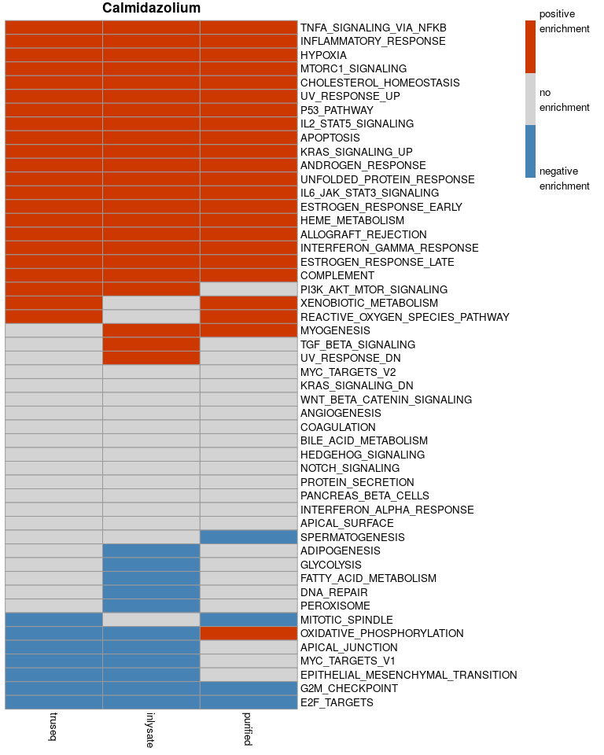<!-- -->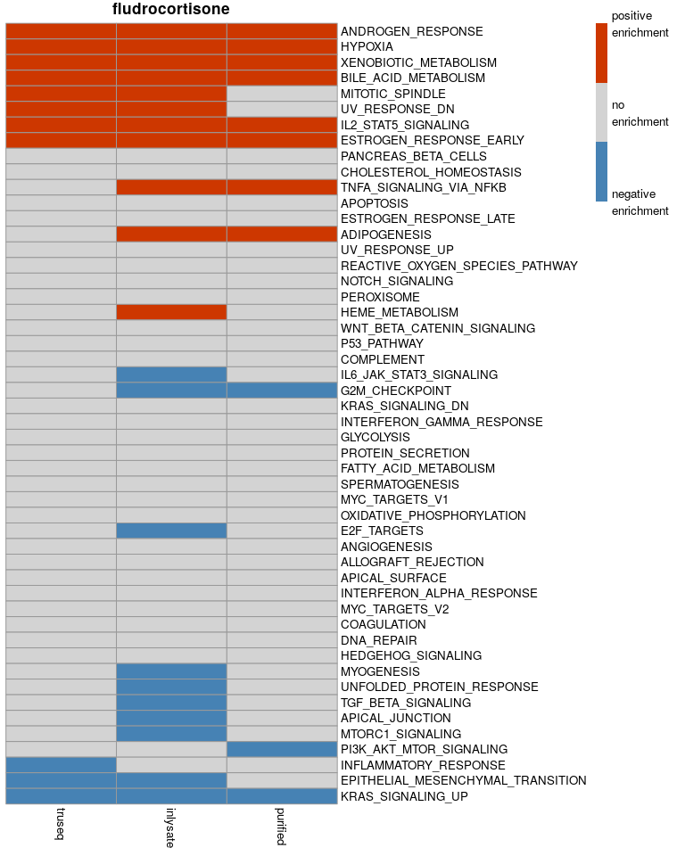<!-- -->

## R environment information

``` r
sessionInfo()
```

    ## R version 4.1.1 (2021-08-10)
    ## Platform: x86_64-pc-linux-gnu (64-bit)
    ## Running under: Ubuntu 18.04.6 LTS
    ## 
    ## Matrix products: default
    ## BLAS/LAPACK: /opt/OpenBLAS/lib/libopenblasp-r0.3.3.so
    ## 
    ## locale:
    ##  [1] LC_CTYPE=en_US.UTF-8       LC_NUMERIC=C              
    ##  [3] LC_TIME=en_US.UTF-8        LC_COLLATE=en_US.UTF-8    
    ##  [5] LC_MONETARY=en_US.UTF-8    LC_MESSAGES=en_US.UTF-8   
    ##  [7] LC_PAPER=en_US.UTF-8       LC_NAME=C                 
    ##  [9] LC_ADDRESS=C               LC_TELEPHONE=C            
    ## [11] LC_MEASUREMENT=en_US.UTF-8 LC_IDENTIFICATION=C       
    ## 
    ## attached base packages:
    ## [1] stats4    stats     graphics  grDevices utils     datasets  methods  
    ## [8] base     
    ## 
    ## other attached packages:
    ##  [1] reshape2_1.4.4              fgsea_1.20.0               
    ##  [3] tximport_1.22.0             rhdf5_2.38.1               
    ##  [5] MASS_7.3-54                 ROCR_1.0-11                
    ##  [7] gridExtra_2.3               cowplot_1.1.3              
    ##  [9] biomaRt_2.50.3              pheatmap_1.0.12            
    ## [11] tidyr_1.3.1                 dplyr_1.1.4                
    ## [13] tibble_3.2.1                stringr_1.4.0              
    ## [15] purrr_1.0.2                 readr_2.1.5                
    ## [17] ggplot2_3.5.1               DESeq2_1.34.0              
    ## [19] SummarizedExperiment_1.24.0 Biobase_2.54.0             
    ## [21] MatrixGenerics_1.6.0        matrixStats_0.62.0         
    ## [23] GenomicRanges_1.46.1        GenomeInfoDb_1.30.1        
    ## [25] IRanges_2.28.0              S4Vectors_0.32.4           
    ## [27] BiocGenerics_0.40.0        
    ## 
    ## loaded via a namespace (and not attached):
    ##  [1] nlme_3.1-152           bitops_1.0-7           bit64_4.0.5           
    ##  [4] filelock_1.0.2         RColorBrewer_1.1-3     progress_1.2.3        
    ##  [7] httr_1.4.7             tools_4.1.1            utf8_1.2.4            
    ## [10] R6_2.5.1               mgcv_1.8-36            DBI_1.2.2             
    ## [13] colorspace_2.1-0       rhdf5filters_1.6.0     withr_3.0.0           
    ## [16] tidyselect_1.2.1       prettyunits_1.2.0      bit_4.0.5             
    ## [19] curl_5.2.1             compiler_4.1.1         cli_3.6.2             
    ## [22] xml2_1.3.6             DelayedArray_0.20.0    labeling_0.4.3        
    ## [25] scales_1.3.0           genefilter_1.76.0      rappdirs_0.3.3        
    ## [28] digest_0.6.35          rmarkdown_2.26         XVector_0.34.0        
    ## [31] pkgconfig_2.0.3        htmltools_0.5.8.1      highr_0.10            
    ## [34] dbplyr_2.5.0           fastmap_1.1.1          rlang_1.1.3           
    ## [37] rstudioapi_0.16.0      RSQLite_2.3.6          farver_2.1.1          
    ## [40] generics_0.1.3         BiocParallel_1.28.3    RCurl_1.98-1.7        
    ## [43] magrittr_2.0.3         GenomeInfoDbData_1.2.7 Matrix_1.5-3          
    ## [46] Rhdf5lib_1.16.0        Rcpp_1.0.12            munsell_0.5.1         
    ## [49] fansi_1.0.6            lifecycle_1.0.4        stringi_1.8.3         
    ## [52] yaml_2.3.8             zlibbioc_1.40.0        plyr_1.8.9            
    ## [55] BiocFileCache_2.2.1    grid_4.1.1             blob_1.2.4            
    ## [58] parallel_4.1.1         crayon_1.5.2           lattice_0.20-44       
    ## [61] Biostrings_2.62.0      splines_4.1.1          annotate_1.72.0       
    ## [64] hms_1.1.3              KEGGREST_1.34.0        locfit_1.5-9.5        
    ## [67] knitr_1.46             pillar_1.9.0           geneplotter_1.72.0    
    ## [70] fastmatch_1.1-3        XML_3.99-0.10          glue_1.7.0            
    ## [73] evaluate_0.23          data.table_1.15.4      png_0.1-7             
    ## [76] vctrs_0.6.5            tzdb_0.4.0             gtable_0.3.5          
    ## [79] cachem_1.0.8           xfun_0.43              xtable_1.8-4          
    ## [82] survival_3.2-11        AnnotationDbi_1.56.2   memoise_2.0.1

``` r
#capture.output(sessionInfo(), file = "./session_info.txt")
```
